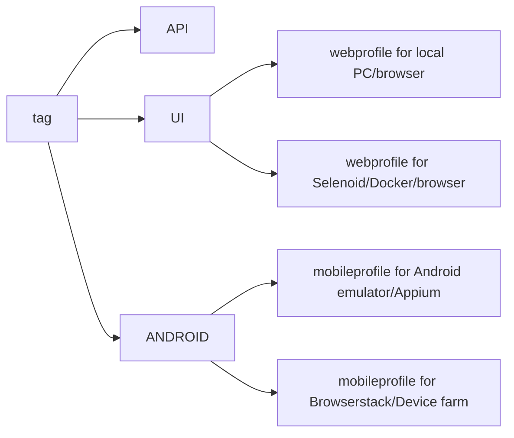

# Test automation project for [IntelInvest.ru](https://intelinvest.ru)
\
It is a service for control over the trades in the investment portfolio. 

# <a name="TableOfContents">Table of contents</a>

## <a name="Description">Description</a>

The test project consists of Web and API tests. (Mobile tests are under development)\
Some technologies and tricks used in the project:

- [x] `Page Object` with steps using `Chain of Invocations`
- [x] Parametrized tests
- [x] Parametrized build
- [x] Different configuration files for test running depending on build parameters
- [x] Config with `Owner` library
- [x] Use `Lombok` plugin for API DTOs
- [x] Using request specifications for API tests
- [x] Allure listeners used for UI and API tests for beautiful reports
- [x] `Allure TestOps` integration
- [x] Autotests as test documentation
- [x] Failing tests retries
- [x] API methods used in UI tests for faster data preparation
- [x] Used API request and work with local storage for faster user login. 
Custom extension `@WithLogin` developed.

## Tools used:
 </br></br>

The autotests in this project are written in `Java` using `Selenide` framework.\
`Gradle` - is used as a build tool.  \
`JUnit5` - testing framework.\
`REST Assured` - for testing of REST services.\
`Jenkins` - CI/CD for running tests remotely.\
`Selenoid` - to remote launching browsers in `Docker` containers.\
`Allure Report` - for test results visualisation.\
`Telegram` - for test results notifications.\
`Allure TestOps` - as Test Management System.

# <a name="HowToRun">How to run</a>

## <a name="HowToRunCommandLine">How to run tests from command line</a>
To run all tests with default parameters locally
```bash
gradle clean test
```

Parameters\
`-Dtags="('UI','API','ANDROID')"` - to run tests with specific tags. Tags can be listed with comma separator\
`-Dwebprofile` - to set *.properties file with settings for UI and API tests (name without extension)\
`-Dmobileprofile` - to set *.properties file with settings for Mobile tests (name without extension)\
Sample properties files can be found in resources/config package. Several configuration files can be created for all 
possible test configurations.\

## <a name="PropertyFiles">Property files</a>

- `app.properties` file for settings of application
```properties
webUrl=
apiUrl=
mobileAppPath=
mobileAppPackage=
mobileAppActivity=
```
- `user.properties` file for user data
```properties
  userName=
  userPassword=
  foreignPortfolio=
```
- `{webprofile}.properties` file for settings of environment where UI tests should be run
```properties
  browser=
  browserVersion= 
  browserSize= 
```
if tests should be run in Selenoid, then the following parameters should also have values:
```properties
  remoteWebDriver= 
  remoteUrl=
```
- `{mobileprofile}.properties` file for settings of environment where UI tests should be run
```properties
  mobileVersion=
  mobilePlatformName=
  mobileDeviceName=
```
For local run in Android emulator using Appium also set the following property
```properties
mobileUrl=
```
For remote run in Browserstack mobile device farm also set properties:
```properties
remoteMobileUrl=
remoteMobileAPIUrl=
appUrl=
bsUserName=
bsAccessKey=
```
Default values are set for parameters for local run.

Possible combinations of test run profiles:

