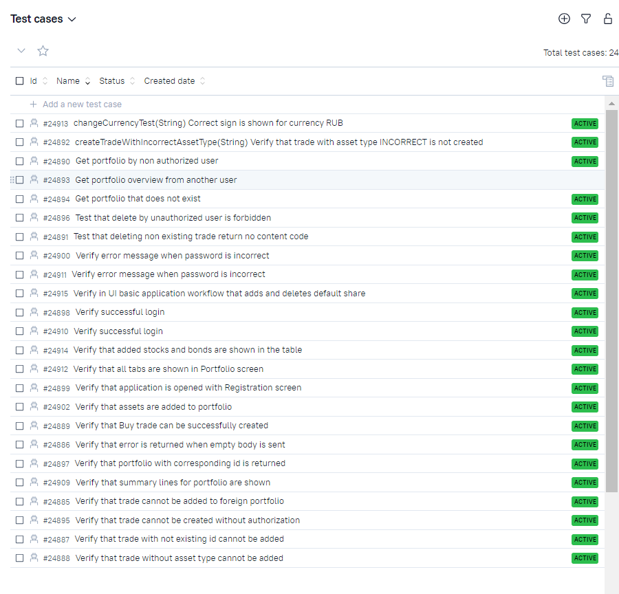

# Test automation project for [IntelInvest.ru](https://intelinvest.ru)
\
IntelInvest is a service for control over the trades in the investment portfolio. 

# <a name="Description">Description</a>

The test project has been developed to demonstrate fully functioning integrated process of automated testing.
Test framework contains Web,API and Mobile tests.
Some technologies and tricks used in the project:

- [x] `Page Object` with steps using `Chain of Invocations`
- [x] Parametrized tests
- [x] Different configuration files for test running depending on build parameters
- [x] Extract config information into .properties files with `Owner` library
- [x] Use `Lombok` plugin for API DTOs
- [x] Using request specifications for API tests
- [x] `Allure` listeners used for UI and API tests for beautiful reports
- [x] API methods used in UI tests for faster data preparation
- [x] Flaky tests retries
- [x] Used API request and work with local storage for faster user login.
  Custom extension `@WithLogin` developed.

## <a>Automated tests running in cloud infrastructure</a>
- Tests run with parameter has been set up in [Jenkins](#HowToRunInJenkins)
- [Allure reports](#Allure) are automatically built. Reports contain extensive information about test run:
  browser logs, API logs, screenshots, [video records](#Video).
- Test running has been integrated with [AllureTestOps](#AllureTestOps): to use autotests as test documentation,to build live test documentation,
  to run tests from AllureTestOps, review status of tests and use other options of the TMS.
- [Telegram notifications](#TelegramNotifications) sending after tests finish has been set up.
- [Jira integration](#Jira) has been set up.

## Tools used:
 </br></br>

The autotests in this project are written in `Java` using `Selenide` framework.\
`Gradle` - is used as a build tool.  \
`JUnit5` - testing framework.\
`REST Assured` - for testing of REST services.\
`Jenkins` - CI/CD for running tests remotely.\
`Selenoid` - to remote launching browsers in `Docker` containers.\
`Allure Report` - for test results visualisation.\
`Telegram` - for test results notifications.\
`Allure TestOps` - as Test Management System.

# <a name="HowToRun">Tests run and settings</a>

## <a name="HowToRunCommandLine">How to run tests from command line</a>
To run all tests with default parameters locally
```bash
gradle clean test
```

Parameters\
`-Dtags="('UI','API','ANDROID')"` - to run tests with specific tags. Tags can be listed with comma separator\
`-Dwebprofile` - to set *.properties file with settings for UI and API tests (name without extension)\
`-Dmobileprofile` - to set *.properties file with settings for Mobile tests (name without extension)\
Sample properties files can be found in resources/config package. Several configuration files can be created for all 
possible test configurations.\

## <a name="PropertyFiles">Property files</a>

- `app.properties` file for settings of application
```properties
webUrl=
apiUrl=
mobileAppPath=
mobileAppPackage=
mobileAppActivity=
```
- `user.properties` file for user data
```properties
  userName=
  userPassword=
  foreignPortfolio=
```
- `{webprofile}.properties` file for settings of environment where UI tests should be run
```properties
  browser=
  browserVersion= 
  browserSize= 
```
if tests should be run in Selenoid, then the following parameters should also have values:
```properties
  remoteWebDriver= 
  remoteUrl=
```
- `{mobileprofile}.properties` file for settings of environment where UI tests should be run
```properties
  mobileVersion=
  mobilePlatformName=
  mobileDeviceName=
```
For local run in Android emulator using Appium also set the following property
```properties
mobileUrl=
```
For remote run in Browserstack mobile device farm also set properties:
```properties
remoteMobileUrl=
remoteMobileAPIUrl=
appUrl=
bsUserName=
bsAccessKey=
```
Default values are set for parameters for local run.\
All build parameters can be set either in .properties files or by system properties. In this project no sensitive data is stored in GitHub, but set as 
system variables for Gradle build.

Possible combinations of test run profiles:


## <a name="HowToRunInJenkins">Jenkins settings</a>
Tests can be run with parameters. All parameters are described
<p  align="center">

</p>

## <a name="Allure">Allure Report</a>
<p  align="center">

</p>

## <a name="AllureTestOps">Allure TestOps Dashboard</a>
Note that test cases in AllureTestOps are automatically imported from auto tests
Flat list of test cases in AllureTestOps
<p  align="center">

</p>

Test cases grouped by Feature in AllureTestOps
<p  align="center">

</p>

Test cases grouped by Suites in AllureTestOps
<p  align="center">

</p>

## <a name="TelegramNotifications">Telegram notifications</a>
After the test run has been finished the notification is sent to telegram. Notifications can be sent to a number of messengers
<p  align="center">

</p>


## <a name="Jira">Jira integration</a>
Test cases and results of tests launches have been integrated in Jira to provide correct and fully clear QA process.
<p  align="center">

</p>


## <a name="Video">Video of tests</a>
Web test:
<p align="center">
  
</p>

Android mobile test:
<p align="center">
  
</p>
