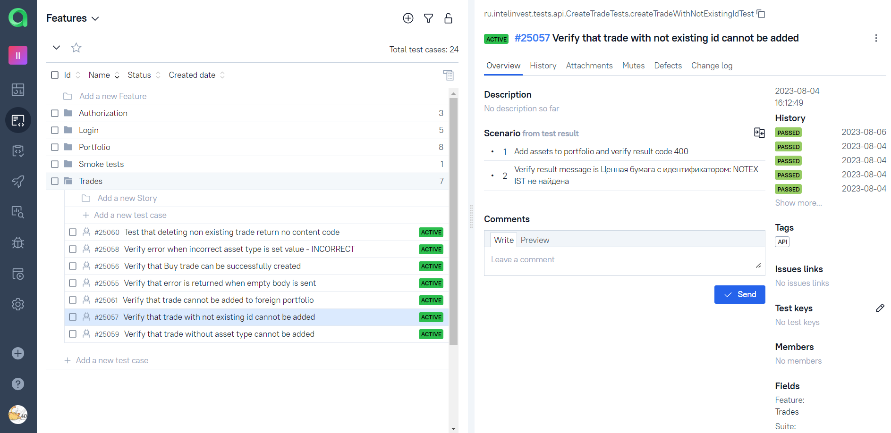
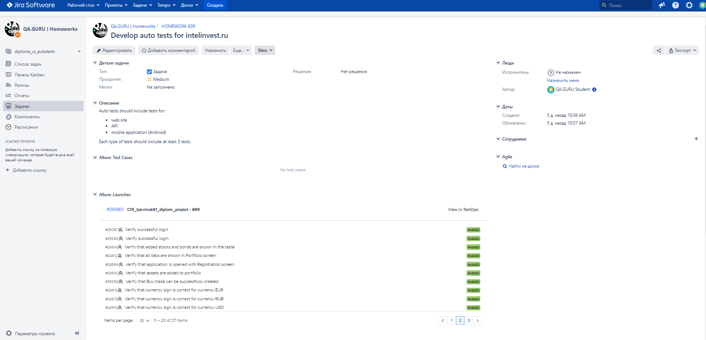

# Test automation project for [IntelInvest.ru](https://intelinvest.ru)

\
IntelInvest is a service for control over the trades in the investment portfolio.

# <a name="Description">Description</a>

The test project has been developed to demonstrate fully functioning integrated process of automated testing.
Test framework contains Web,API and Mobile tests.
Some technologies and tricks used in the project:

- [x] `Page Object` with steps using `Chain of Invocations`
- [x] Parametrized tests
- [x] Different configuration files for test running depending on build parameters
- [x] Extract config information into .properties files with `Owner` library
- [x] Use `Lombok` plugin for API DTOs
- [x] Using request specifications for API tests
- [x] `Allure` listeners used for UI and API tests for beautiful reports
- [x] API methods used in UI tests for faster data preparation
- [x] Flaky tests retries
- [x] Used API request and work with local storage for faster user login.
  Custom extension `@WithLogin` developed.

## <a name="Tests">Implemented tests</a>

<details>
<summary>Web UI tests:</summary>

- Web tests for login functionality
  - Verify error message when password is incorrect
  - Verify successful login
- Web tests for portfolio
    - Verify that added stocks and bonds are shown in the table
    - Verify that all tabs are shown in Portfolio screen
    - Verify that currency sign is correct for currency (Parameterized test)
- Web tests: smoke
  - Verify in UI basic application workflow that adds and deletes default share
</details>

<details>

<summary>API tests:</summary>

- API tests without authorization data for endpoints
    - Verify that get portfolio by unauthorized user is forbidden
    - Verify that delete by unauthorized user is forbidden
    - Verify that trade cannot be created without authorization
- API tests for portfolio-info endpoint
    - Verify that portfolio with corresponding id is returned
- API tests for portfolio overview endpoint
    - Verify that get portfolio overview from another user returns error
    - Verify that get portfolio that does not exist returns error
- API tests for deleteAll trades post request
    - Verify that deleting non-existing trade returns no content code
- API tests for create trade post request
    - Verify error when incorrect asset type is set value (Parameterized test)
    - Verify that Buy trade can be successfully created
    - Verify that error is returned when empty body is sent
    - Verify that trade cannot be added to foreign portfolio
    - Verify that trade with not existing id cannot be added
    - Verify that trade without asset type cannot be added

</details>
<details>
<summary>Mobile Android tests:</summary>

- Android tests for login functionality
    - Verify error message when password is incorrect
    - Verify successful login
    - Verify that application is opened with Registration screen
- Android tests for portfolio
    - Verify that assets are added to portfolio
    - Verify that summary lines for portfolio are shown
</details>

## <a>Automated tests running in cloud infrastructure</a>

- Tests run with parameter has been set up in [Jenkins](#HowToRunInJenkins)
- [Allure reports](#Allure) are automatically built. Reports contain extensive information about test run:
  browser logs, API logs, screenshots, [video records](#Video).
- Test running has been integrated with [AllureTestOps](#AllureTestOps): to use autotests as test documentation,to build
  live test documentation,
  to run tests from AllureTestOps, review status of tests and use other options of the TMS.
- [Telegram notifications](#TelegramNotifications) sending after tests finish has been set up.
- [Jira integration](#Jira) has been set up.

## Tools used:

<a href="https://www.java.com/"></a>
<a href="https://gradle.org/"></a>
<a href="https://www.jetbrains.com/idea/"></a>
<a href="https://selenide.org/"></a>
<a href="https://rest-assured.io/"></a>
<a href="http://appium.io/docs/en/2.0/"></a>
<a href="https://developer.android.com/studio"></a>
<a href="https://aerokube.com/selenoid/latest/"></a>
<a href="https://junit.org/junit5/"></a>
<a href="https://www.jenkins.io/"></a>
<a href="https://qameta.io/allure-report/"></a>
<a href="https://qameta.io/"></a>
<a href="https://telegram.org/"></a>
<a href="https://www.atlassian.com/software/jira"></a></br></br>

The autotests in this project are written in `Java` using `Selenide` framework.\
`Gradle` - is used as a build tool.  \
`JUnit5` - testing framework.\
`REST Assured` - for testing of REST services.\
`Appium` - for UI automation of mobile application.\
`Android Studio` - for Android device emulator.\
`Jenkins` - CI/CD for running tests remotely.\
`Selenoid` - to remote launching browsers in `Docker` containers.\
`Allure Report` - for test results visualisation.\
`Telegram` - for test results notifications.\
`Allure TestOps` - as Test Management System.\
`Jira` - as issue tracking software

# <a name="HowToRun">Tests run and settings</a>

## <a name="HowToRunCommandLine">How to run tests from command line</a>

To run all tests with default parameters locally

```bash
gradle clean test
```

Parameters\
`-Dtags="('UI','API','ANDROID')"` - to run tests with specific tags. Tags can be listed with comma separator\
`-Dwebprofile` - to set *.properties file with settings for UI and API tests (name without extension)\
`-Dmobileprofile` - to set *.properties file with settings for Mobile tests (name without extension)\
Sample properties files can be found in resources/config package. Several configuration files can be created for all
possible test configurations.\

## <a name="PropertyFiles">Property files</a>

- `app.properties` file for settings of application

```properties
webUrl=
apiUrl=
mobileAppPath=
mobileAppPackage=
mobileAppActivity=
```

- `user.properties` file for user data

```properties
userName=
userPassword=
foreignPortfolio=
```

- `{webprofile}.properties` file for settings of environment where UI tests should be run

```properties
browser=
browserVersion=
browserSize= 
```

if tests should be run in Selenoid, then the following parameters should also have values:

```properties
remoteWebDriver=
remoteUrl=
```

- `{mobileprofile}.properties` file for settings of environment where UI tests should be run

```properties
mobileVersion=
mobilePlatformName=
mobileDeviceName=
```

For local run in Android emulator using Appium also set the following property

```properties
mobileUrl=
```

For remote run in Browserstack mobile device farm also set properties:

```properties
remoteMobileUrl=
remoteMobileAPIUrl=
appUrl=
bsUserName=
bsAccessKey=
```

Default values are set for parameters for local run.\
All build parameters can be set either in .properties files or by system properties.
> [!NOTE]
> In this project no sensitive data is stored in GitHub, but created on the fly during build in Jenkins.

Possible combinations of test run profiles:


## <a name="HowToRunInJenkins" href="https://jenkins.autotests.cloud/job/C19_barvinok61_diplom_project/">Jenkins settings</a>

Tests can be run with parameters. All parameters are described
<p  align="center">

</p>

## <a name="Allure" href="https://jenkins.autotests.cloud/job/C19_barvinok61_diplom_project/89/allure/">Allure Report</a>

Summary
<p  align="center">

</p>
Test cases
<p  align="center">

</p>

## <a name="AllureTestOps">Allure TestOps Dashboard</a>

Note that test cases in AllureTestOps are automatically imported from auto tests
Flat list of test cases in AllureTestOps
<p  align="center">

</p>

Test cases grouped by Feature in AllureTestOps
<p  align="center">

</p>

Test cases grouped by Suites in AllureTestOps
<p  align="center">

</p>

## <a name="TelegramNotifications">Telegram notifications</a>

After the test run has been finished the notification is sent to telegram. Notifications can be sent to a number of
messengers
<p  align="center">

</p>

## <a name="Jira">Jira integration</a>

Test cases and results of tests launches have been integrated in Jira to provide correct and fully clear QA process.
<p  align="center">

</p>

## <a name="Video">Video of tests</a>

Web test:
<p align="center">
  
</p>

Android mobile test:
<p align="center">
  
</p>
